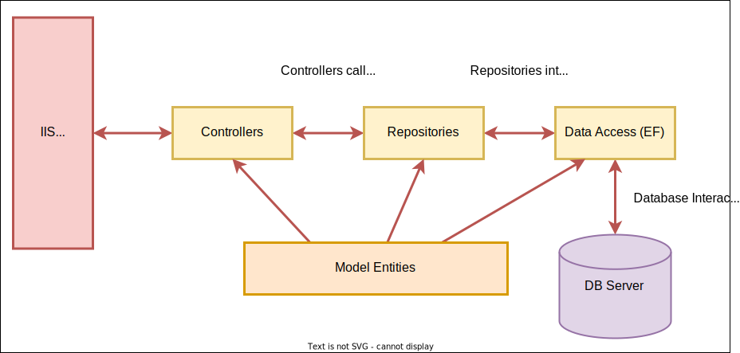

<h1 style="text-align: center">Ecommerce API with .Net</h1>

## Features 

1. Implement Repository with Unit Of Work Patterns.
2. Utilize Entity Framework as a data access layer.
3. User Authentication using JWT.
4. Role-based Authorization managed by Identity.

## Architecture

## Endpoints 

|API | Description | Request body | Response body | Permission | 
|--- | ---- | ---- | ---- | ---- | 
|`POST /api/account/register` | allow user to register | UserRegisterDto | UserDto| Anonymous | 
|`POST /api/account/login` | allow user to login | UserLoginDto | UserDto | Anonymous | 
|`GET /api/product` | Get a list of all products | None | List<Product> | Anonymous | 
|`GET /api/product/{id}` | Get a specific product | None | Product | Anonymous | 
|`POST /api/product` | Add a new Product | CreateProductDto | Product | Admin | 
|`PUT /api/product` | Update an existing Product &nbsp; | UpdateProductDto | Product | Admin |  
|`DELETE /api/product/{id}` &nbsp; &nbsp; | Delete a product &nbsp; &nbsp; | None | None| Admin | 
|`POST /api/order` | Create a new order | CreateProductDto | Product | User | 
|`GET /api/order` | Get all orders for a specific user &nbsp; | List<OrderDto> | None | User |  
|`GET /api/product/{id}` &nbsp; &nbsp; | Get A single order for a specific user &nbsp; &nbsp; | OrderDto | None| User | 